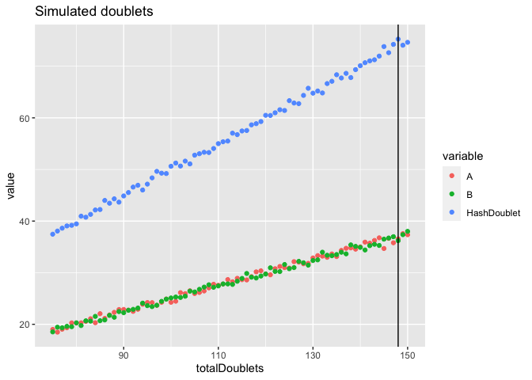
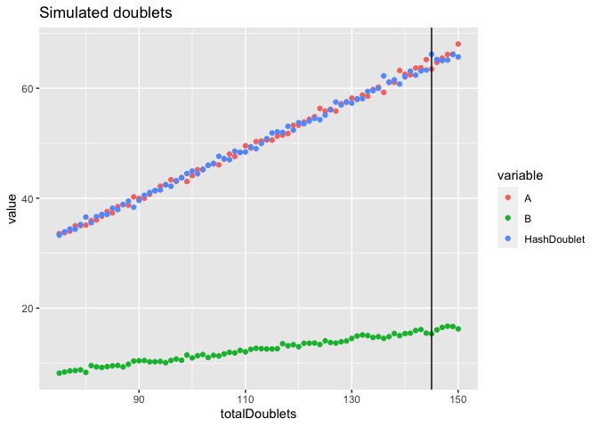
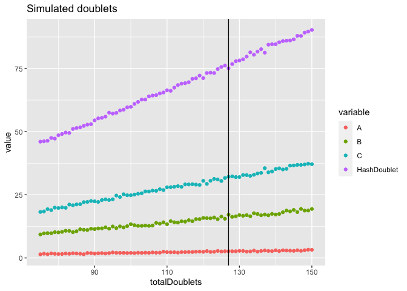
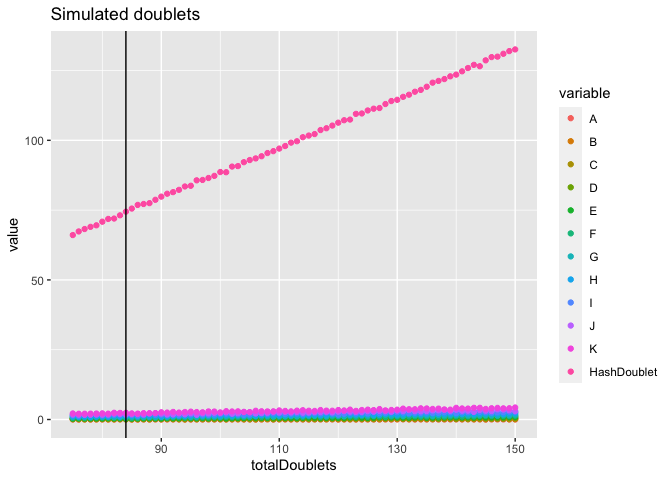
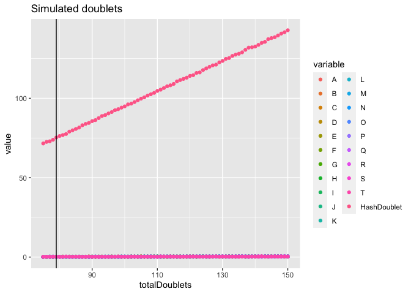
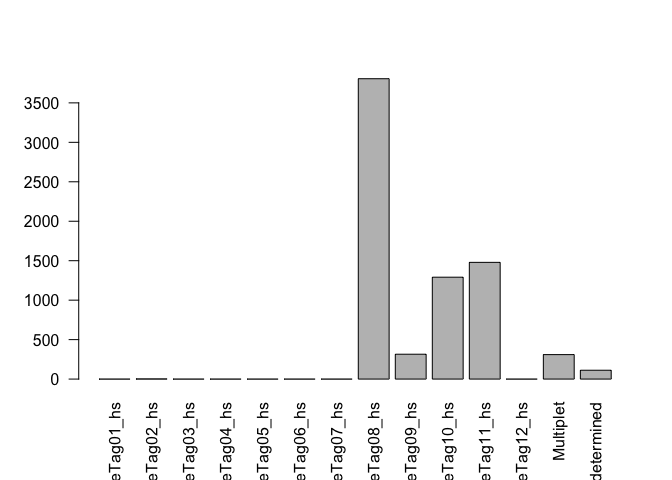
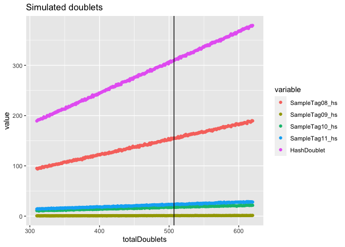

Doublet rate prediction
================
Asa Bjorklund
28/08/23

- <a href="#2-samples-at-equal-distribution"
  id="toc-2-samples-at-equal-distribution">2 samples at equal
  distribution.</a>
- <a href="#test-different-scenarios"
  id="toc-test-different-scenarios">Test different scenarios</a>
  - <a href="#more-of-1-sample" id="toc-more-of-1-sample">More of 1
    sample</a>
  - <a href="#3-samples" id="toc-3-samples">3 samples</a>
  - <a href="#10-samples" id="toc-10-samples">10 samples</a>
  - <a href="#20-samples" id="toc-20-samples">20 samples</a>
- <a href="#real-data" id="toc-real-data">Real data</a>

``` r
suppressPackageStartupMessages(library(ggplot2))
suppressPackageStartupMessages(library(reshape2))

source("predict_hashed_doublet_rates.R")
```

Given the number of cells per hashtag in an experiment and the number of
double tags observed, the intra-sample doublet rate can be calculated
for each sample.

Assuming that the sample distribution in the hashed cells and in the
doublets is the same, e.g. that there is no sample bias in doublet
creation. Also, assumes that all multiplets consists of 2 cells.

The function `predict_hashed_doublet_rates` will create artificial
doublets from the observed distribution, randomly selected 100 times.
Simulations are done across different doublet rates and then identifies
the rate closest to the observed for across hashtag doublets.

## 2 samples at equal distribution.

Define cells as 500 of each sample and 75 multiplets.

``` r
nMulti = 75
nCells = c(500,500)
names(nCells) = c("A","B")

print(nCells)
```

    ##   A   B 
    ## 500 500

``` r
out = predict_hashed_doublet_rates(nCells, 75)
```

<!-- -->

``` r
print(out)
```

    ##               nDoublets PercentageTotal PercentageSample
    ## A                 36.54           3.654            7.308
    ## B                 36.21           3.621            7.242
    ## HashDoublet       75.25           7.525               NA
    ## totalDoublets    148.00          14.800               NA

## Test different scenarios

### More of 1 sample

``` r
nCells[1] = 1000
nCells
```

    ##    A    B 
    ## 1000  500

``` r
out = predict_hashed_doublet_rates(nCells, 75)
```

<!-- -->

``` r
print(out)
```

    ##               nDoublets PercentageTotal PercentageSample
    ## A                 63.48        4.232000            6.348
    ## B                 15.34        1.022667            3.068
    ## HashDoublet       66.18        4.412000               NA
    ## totalDoublets    145.00        9.666667               NA

### 3 samples

Different number of each sample, still 75 observed multiplets.

``` r
nCells = c(200,500,700)
names(nCells) = LETTERS[1:length(nCells)]
nCells
```

    ##   A   B   C 
    ## 200 500 700

``` r
out = predict_hashed_doublet_rates(nCells, 75)
```

<!-- -->

``` r
print(out)
```

    ##               nDoublets PercentageTotal PercentageSample
    ## A                  2.54       0.1814286         1.270000
    ## B                 16.34       1.1671429         3.268000
    ## C                 31.44       2.2457143         4.491429
    ## HashDoublet       74.68       5.3342857               NA
    ## totalDoublets    125.00       8.9285714               NA

### 10 samples

Different number of each sample

``` r
nCells = seq(100,1100,100)
names(nCells) = LETTERS[1:length(nCells)]
nCells
```

    ##    A    B    C    D    E    F    G    H    I    J    K 
    ##  100  200  300  400  500  600  700  800  900 1000 1100

``` r
out = predict_hashed_doublet_rates(nCells, 75)
```

<!-- -->

``` r
print(out)
```

    ##               nDoublets PercentageTotal PercentageSample
    ## A                  0.04    0.0006060606        0.0400000
    ## B                  0.09    0.0013636364        0.0450000
    ## C                  0.09    0.0013636364        0.0300000
    ## D                  0.19    0.0028787879        0.0475000
    ## E                  0.36    0.0054545455        0.0720000
    ## F                  0.61    0.0092424242        0.1016667
    ## G                  0.97    0.0146969697        0.1385714
    ## H                  1.38    0.0209090909        0.1725000
    ## I                  1.60    0.0242424242        0.1777778
    ## J                  1.83    0.0277272727        0.1830000
    ## K                  2.40    0.0363636364        0.2181818
    ## HashDoublet       74.44    1.1278787879               NA
    ## totalDoublets     84.00    1.2727272727               NA

### 20 samples

Equal number of each sample

``` r
nCells = rep(500, 20)
names(nCells) = LETTERS[1:length(nCells)]
nCells
```

    ##   A   B   C   D   E   F   G   H   I   J   K   L   M   N   O   P   Q   R   S   T 
    ## 500 500 500 500 500 500 500 500 500 500 500 500 500 500 500 500 500 500 500 500

``` r
out = predict_hashed_doublet_rates(nCells, 75)
```

<!-- -->

``` r
print(out)
```

    ##               nDoublets PercentageTotal PercentageSample
    ## A                  0.18          0.0018            0.036
    ## B                  0.27          0.0027            0.054
    ## C                  0.28          0.0028            0.056
    ## D                  0.15          0.0015            0.030
    ## E                  0.29          0.0029            0.058
    ## F                  0.18          0.0018            0.036
    ## G                  0.22          0.0022            0.044
    ## H                  0.18          0.0018            0.036
    ## I                  0.17          0.0017            0.034
    ## J                  0.15          0.0015            0.030
    ## K                  0.24          0.0024            0.048
    ## L                  0.11          0.0011            0.022
    ## M                  0.18          0.0018            0.036
    ## N                  0.12          0.0012            0.024
    ## O                  0.11          0.0011            0.022
    ## P                  0.11          0.0011            0.022
    ## Q                  0.21          0.0021            0.042
    ## R                  0.26          0.0026            0.052
    ## S                  0.16          0.0016            0.032
    ## T                  0.17          0.0017            0.034
    ## HashDoublet       75.26          0.7526               NA
    ## totalDoublets     79.00          0.7900               NA

## Real data

Data from Nima with 4 samples, uneven distribution of cell numbers.

``` r
stats = read.csv("stats.txt")

nCells = stats$Cells_Called[-1]
names(nCells) = stats$Sample_Tag[-1]

barplot(nCells, las = 2)
```

<!-- -->

``` r
nCells
```

    ## SampleTag01_hs SampleTag02_hs SampleTag03_hs SampleTag04_hs SampleTag05_hs 
    ##              0              2              0              0              0 
    ## SampleTag06_hs SampleTag07_hs SampleTag08_hs SampleTag09_hs SampleTag10_hs 
    ##              0              0           3806            315           1291 
    ## SampleTag11_hs SampleTag12_hs      Multiplet   Undetermined 
    ##           1479              0            310            112

Have 4 samples with 315 to 3806 cells, 4% doublets and 1.5% undermined.

``` r
# Ignore all other sample tags
nMulti = nCells["Multiplet"]
nCells = nCells[c(8:11)]

out = predict_hashed_doublet_rates(nCells, nMulti)
```

<!-- -->

``` r
print(out)
```

    ##                nDoublets PercentageTotal PercentageSample
    ## SampleTag08_hs    155.02      2.24960093        4.0730426
    ## SampleTag09_hs      1.14      0.01654332        0.3619048
    ## SampleTag10_hs     17.57      0.25497025        1.3609605
    ## SampleTag11_hs     23.44      0.34015382        1.5848546
    ## HashDoublet       309.83      4.49615440               NA
    ## totalDoublets     507.00      7.35742273               NA
